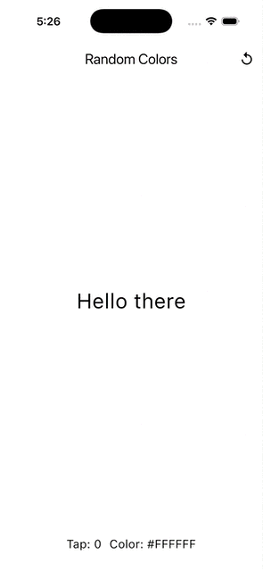
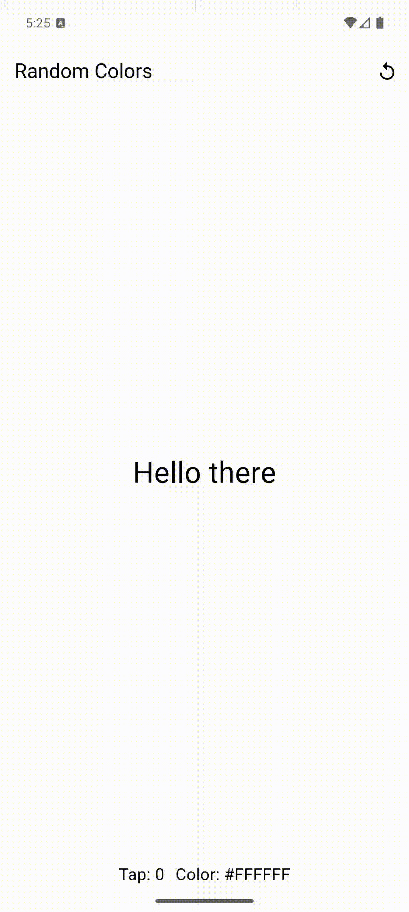

## Random Colors App
*Application developed with using MVVM Architecture*

### Main features
* Random colors with 16777216 variants without external colors generation libraries
* Change color after tap on the screen
* Text on middle of the screen

### Additional features
* History of a three last colors
* Count tapping of the screen
* Reset state to default

## Demo

    
    

### Color Generation Choice
While implementing random color generation, I considered two approaches:

* Color((Random().nextDouble() * 0xFFFFFF).toInt()).withOpacity(1.0)
– A commonly used solution found on StackOverflow.
* Color.fromRGBO(random.nextInt(256), random.nextInt(256), random.nextInt(256), 1)
– A more explicit method I’ve used before when working with similar logic in SwiftUI.

I chose the second option because it's more readable and doesn’t require dealing with bitwise operations.